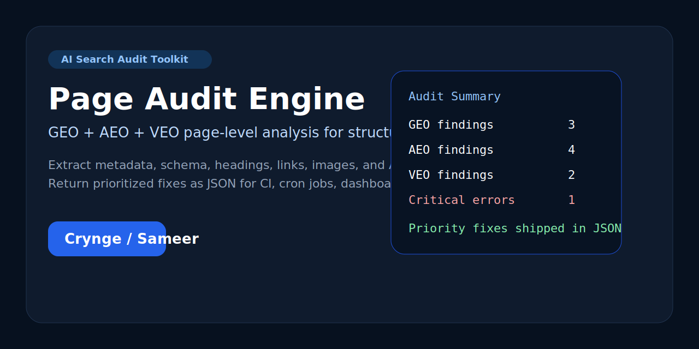

# Page Audit Engine

[](https://www.python.org/downloads/)
[](LICENSE)
[](https://github.com/Crynge/page-audit-engine/actions/workflows/tests.yml)
[](https://github.com/Crynge/page-audit-engine/actions/workflows/repo-health.yml)



Production-ready **page-level GEO, AEO, and VEO audit automation** for marketers, content teams, technical SEO operators, and AI-search consultants. The project extracts page signals, sends a structured audit payload to an OpenAI-compatible model, and returns **prioritized search visibility fixes** in JSON for pipelines, dashboards, and automation tools.

## Why this repo matters

`page-audit-engine` is designed for teams that need more than a generic SEO crawler:

- **GEO** for generative engine optimization and AI-search discoverability
- **AEO** for answer engine optimization and snippet-ready content checks
- **VEO** for voice engine optimization and conversational search readiness
- **Structured JSON output** for CI jobs, cron runs, webhook chains, and n8n workflows
- **Fast local execution** with a simple Python CLI instead of a full SaaS dependency

## Public surfaces

- [Technical audit notes](./docs/final-audit.md)
- [Security policy](./SECURITY.md)
- [Contributing guide](./CONTRIBUTING.md)
- [Authors](./AUTHORS.md)
- [GitHub SEO metadata](./.github/TOPICS.md)

## Core features

- HTML fetching with retry logic, timeouts, and robust user-agent defaults
- On-page extraction for titles, descriptions, headings, links, images, schema, canonical URLs, and language attributes
- AI-powered GEO/AEO/VEO interpretation using OpenAI-compatible APIs
- Structured JSON response validation with fallback normalization
- Rich terminal summaries for consultants and operators
- Report export into `reports/*.json` for downstream automation

## Repository layout

```text
page-audit-engine/
├── audit_engine.py
├── main.py
├── config.py
├── tests/
├── reports/
├── docs/
└── .github/
```

## Quick start

```bash
git clone https://github.com/Crynge/page-audit-engine.git
cd page-audit-engine
python -m venv venv
venv\Scripts\activate
pip install -r requirements.txt
copy .env.example .env
python main.py --url "https://example.com/page" --output first-audit
```

## Required configuration

Add these values to `.env`:

```env
OPENAI_API_KEY=your_api_key_here
OPENAI_BASE_URL=https://api.openai.com/v1
OPENAI_MODEL=gpt-4o-mini
REQUEST_TIMEOUT=30
MAX_RETRIES=3
```

Supported providers include:

- OpenAI
- Anthropic-compatible gateways that expose OpenAI-style chat endpoints
- Ollama with the OpenAI compatibility layer
- Groq and other OpenAI-compatible hosted inference providers

## CLI examples

```bash
python main.py --url "https://example.com/page"
python main.py --url "https://example.com/page" --output competitor-homepage
python main.py --url "https://example.com/page" --verbose
python main.py --url "https://example.com/page" --no-file
```

## Output contract

Each run returns a report with:

- `page_signals`
- `geo_findings`
- `aeo_findings`
- `veo_findings`
- `critical_errors`
- `recommendations`
- `priority_fixes`

That makes the repo easy to wire into:

- GitHub Actions
- n8n
- scheduled audits
- internal dashboards
- lead-gen or content QA pipelines

## Verification

Current verification steps are documented in [docs/final-audit.md](./docs/final-audit.md) and include:

- unit tests for extraction, config handling, and audit orchestration
- CLI smoke validation
- repository health checks

Run locally with:

```bash
python -m pytest tests -q
```

## GitHub discoverability

Recommended GitHub description and topic tags are included in:

- [`.github/DESCRIPTION.md`](./.github/DESCRIPTION.md)
- [`.github/TOPICS.md`](./.github/TOPICS.md)

Natural discovery phrases this repo targets:

- page-level GEO audit
- AEO audit engine
- VEO audit tool
- AI search optimization audit
- generative engine optimization Python tool

## Maintainer

Built and maintained by **Sameer Alam**. See [AUTHORS.md](./AUTHORS.md).
